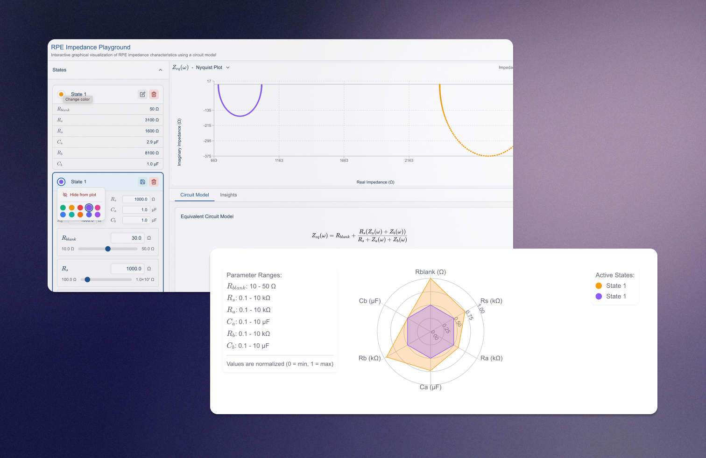

# SpideyPlot - Interactive EIS Circuit Simulator & Visualization

[](https://nei-viz-project.vercel.app/)
[](https://nextjs.org)
[](https://tailwindcss.com)
[](https://github.com/tkpepper15/nei-viz-project/releases/tag/v2.0.0)

> 🕸️ **SpideyPlot** - Advanced electrochemical impedance spectroscopy (EIS) simulation and visualization for retinal pigment epithelium (RPE) research

An interactive web application for simulating and visualizing RPE impedance characteristics using equivalent circuit models, featuring spider plots, parallel computation, and comprehensive parameter space exploration.

<div align="center">
  
</div>

## 🚀 Quick Start

```bash
# Clone the repository
git clone https://github.com/tkpepper15/nei-viz-project.git

# Install dependencies
npm install

# Start the development server
npm run dev
```

Then open [http://localhost:3000](http://localhost:3000) to see the application.

## 🎯 Overview

SpideyPlot empowers researchers and students to:
- 🔬 Explore RPE electrical properties through a sophisticated equivalent circuit model
- 🕸️ Visualize parameter relationships using advanced spider plot technology
- 🚀 Leverage Web Workers for parallel computation of large parameter spaces
- 📊 Analyze impedance data with industry-standard resnorm calculations
- 🎛️ Navigate through an intuitive tabbed interface for different analysis modes
- 📈 Track computation progress with real-time performance monitoring
- 💾 Export data and visualizations for further analysis

## ✨ Key Features

### 🎛️ Modern Interface
- **Tabbed Navigation**: Visualizer, Math Details, Data Table, and Activity Log
- **Collapsible Panels**: Left navigation and right toolbox for customizable workspace
- **Real-time Updates**: Live parameter changes with instant visual feedback
- **Dark Theme**: Professional dark interface optimized for data visualization
- **Responsive Design**: Works seamlessly across different screen sizes

### 🔧 Advanced Circuit Model
Interactive Randles equivalent circuit model with:
- **Series Resistance (Rs)**: 10 - 10,000 Ω
- **Apical Resistance (Ra)**: 10 - 10,000 Ω  
- **Apical Capacitance (Ca)**: 0.1 - 50 µF
- **Basal Resistance (Rb)**: 10 - 10,000 Ω
- **Basal Capacitance (Cb)**: 0.1 - 50 µF
- **Frequency Range**: 0.1 Hz - 10 kHz (configurable)
- **Frequency Points**: 10 - 200 points (logarithmic spacing)

### 🚀 High-Performance Computation
- **Web Workers**: Parallel processing using all available CPU cores
- **Grid Computation**: Explore up to 25^5 parameter combinations (9.7M+ points)
- **Real-time Progress**: Live computation tracking with cancellation support
- **Memory Optimization**: Intelligent sampling for large datasets
- **Performance Monitoring**: CPU usage, memory tracking, and throughput metrics

### 🕸️ Advanced Spider Plot Visualization
- **Interactive Spider Charts**: Navigate parameter space with zoom and pan
- **Resnorm Categorization**: Dynamic percentile-based grouping (25%, 50%, 75%, 90%)
- **Reference Model**: Overlay ground truth parameters for comparison
- **Group Toggling**: Show/hide different quality categories
- **Color Coding**: Intuitive color scheme from excellent (green) to poor (red) fits
- **Opacity Controls**: Adjust transparency for better data visibility

### 📊 Comprehensive Data Analysis
- **Sortable Data Table**: Explore all computed parameter combinations
- **Dynamic Categorization**: Resnorm groups update based on current sort order
- **Export Functionality**: Download data in multiple formats
- **Mathematical Insights**: Detailed equation display with LaTeX rendering
- **Activity Logging**: Complete computation history with timestamps

### 🎯 Smart Performance Features
- **Load Indicators**: Visual feedback for different computational loads:
  - 🟢 Lo Load (≤3,000 points): Green indicator
  - 🟡 Med Load (3,001-8,000 points): Yellow indicator  
  - 🔴 Hi Load (>8,000 points): Red indicator
- **Predicted Counts**: See estimated grid points before computation
- **Adaptive Limits**: Automatic performance optimization for large datasets
- **Background Processing**: Non-blocking computation with UI responsiveness

## 📐 Mathematical Model

### Equivalent Circuit Architecture

The RPE cellular layer is modeled using a modified Randles circuit:

```
       Rs (Series Resistance)
   ────[Rs]────┬──────────┬──────
               │          │
           [Ra]│      [Rb]│
               │          │
           [Ca]│      [Cb]│
               │          │
               └──────────┘
```

**Circuit Components:**
- **Rs**: Series resistance (solution + electrode resistance)
- **Ra**: Apical membrane resistance  
- **Ca**: Apical membrane capacitance
- **Rb**: Basal membrane resistance
- **Cb**: Basal membrane capacitance

### Impedance Calculation

The total circuit impedance is calculated as a parallel combination:

```
Z_total(ω) = (Rs × Z_membranes) / (Rs + Z_membranes)
```

Where the membrane impedances are:

```
Za(ω) = Ra / (1 + jωRaCa)
Zb(ω) = Rb / (1 + jωRbCb)
Z_membranes = Za(ω) + Zb(ω)
```

**Complex Division Implementation:**
```
For Z = (num_real + j×num_imag) / (denom_real + j×denom_imag):

real_part = (num_real × denom_real + num_imag × denom_imag) / |denom|²
imag_part = (num_imag × denom_real - num_real × denom_imag) / |denom|²

where |denom|² = denom_real² + denom_imag²
```

### Enhanced Resnorm Calculation

Our industry-standard resnorm calculation includes sophisticated weighting:

**1. Frequency Weighting**
```
weight_freq = 1 / max(0.1, log₁₀(frequency))
```
Emphasizes low-frequency capacitive behavior crucial for membrane characterization.

**2. Component-Specific Weighting**
```
For f < 100 Hz:  w_real = 1.0, w_imag = 1.5
For f ≥ 100 Hz:  w_real = 1.5, w_imag = 1.0
```
Balances resistive and capacitive contributions across frequency ranges.

**3. Magnitude Normalization**
```
normalized_residual = (Z_test - Z_reference) / |Z_reference|
```
Ensures scale-independent comparison across different impedance magnitudes.

**4. Final Resnorm**
```
resnorm = √(Σ(weighted_residuals²) / Σ(weights)) × range_amplifier
```

**Range Amplification**
```
range_amplifier = {
  3.0  if frequency_ratio < 100    (narrow range)
  2.5  if frequency_ratio < 1000   (moderate range)  
  2.0  otherwise                   (wide range)
}
```

### Dynamic Percentile Grouping

Results are categorized using adaptive percentiles:
- **Excellent Fit** (Top 25%): resnorm ≤ P₂₅ 
- **Good Fit** (25-50%): P₂₅ < resnorm ≤ P₅₀
- **Moderate Fit** (50-75%): P₅₀ < resnorm ≤ P₇₅
- **Acceptable Fit** (75-90%): P₇₅ < resnorm ≤ P₉₀
- **Poor Fit** (Bottom 10%): resnorm > P₉₀

This approach ensures meaningful categorization regardless of parameter space size.

## 🏗️ Project Structure

```
nei-viz-project/
├── app/
│   ├── components/
│   │   ├── circuit-simulator/
│   │   │   ├── controls/           # UI control components
│   │   │   │   ├── ExportModal.tsx
│   │   │   │   ├── PerformanceControls.tsx
│   │   │   │   ├── SystemMonitor.tsx
│   │   │   │   └── ToolboxComponent.tsx
│   │   │   ├── insights/           # Analysis components
│   │   │   │   └── ResnormDisplay.tsx
│   │   │   ├── notifications/      # Status notifications
│   │   │   ├── types/              # TypeScript definitions
│   │   │   ├── utils/              # Computation utilities
│   │   │   │   ├── complex.ts      # Complex number operations
│   │   │   │   ├── impedance.ts    # EIS calculations
│   │   │   │   ├── resnorm.ts      # Residual norm algorithms
│   │   │   │   ├── spider.ts       # Spider plot mathematics
│   │   │   │   └── workerManager.ts # Web Worker coordination
│   │   │   ├── visualizations/     # Plot components
│   │   │   │   ├── SpiderPlot.tsx
│   │   │   │   └── TiledSpiderPlot.tsx
│   │   │   ├── DataTableTab.tsx    # Data analysis interface
│   │   │   ├── MathDetailsTab.tsx  # Mathematical documentation
│   │   │   └── VisualizerTab.tsx   # Main visualization
│   │   └── CircuitSimulator.tsx    # Root component
│   ├── globals.css                 # Global styles
│   ├── layout.tsx                  # App layout
│   └── page.tsx                    # Main page
├── public/
│   ├── enhanced-tile-worker.js     # Web Worker for computation
│   ├── grid-worker.js              # Grid generation worker
│   └── tile-worker.js              # Tile rendering worker
├── types/                          # Global type definitions
└── README.md                       # This file
```

## 🛠️ Technical Stack

- **Framework**: [Next.js 14](https://nextjs.org/) with App Router
- **Language**: [TypeScript](https://www.typescriptlang.org/) for type safety
- **Styling**: [TailwindCSS](https://tailwindcss.com/) with custom dark theme
- **Math Rendering**: [KaTeX](https://katex.org/) for LaTeX equations
- **Visualization**: Custom React components with D3.js mathematics
- **Computation**: Web Workers for parallel processing
- **Performance**: Optimized for large-scale parameter exploration

## 🧑‍💻 Development

### Getting Started
1. Clone the repository
2. Install dependencies: `npm install`
3. Start development server: `npm run dev`
4. Open [http://localhost:3000](http://localhost:3000)

### Key Development Features
- **Hot Reloading**: Instant updates during development
- **TypeScript**: Full type safety and IntelliSense
- **Modular Architecture**: Clean separation of concerns
- **Performance Monitoring**: Built-in computation profiling
- **Error Handling**: Comprehensive error boundaries and logging

### Performance Considerations
- Computation complexity scales as O(n⁵) where n is grid size
- Web Workers prevent UI blocking during large computations
- Memory usage is optimized for datasets up to 10M+ parameter combinations
- Adaptive rendering limits ensure smooth visualization performance

## 📊 Usage Examples

### Basic Parameter Exploration
1. Adjust circuit parameters using the toolbox sliders
2. Click "Compute Grid" to explore parameter space
3. View results in the spider plot visualization
4. Analyze data quality using resnorm categorization

### Large-Scale Analysis
1. Set grid size to 15-20 for comprehensive exploration
2. Monitor computation progress in real-time
3. Use the data table to examine specific parameter combinations
4. Export results for external analysis

### Mathematical Validation
1. Switch to "Math Details" tab to view equations
2. Verify impedance calculations against literature
3. Understand resnorm weighting through detailed explanations
4. Check frequency response characteristics

## 📄 License

MIT License - feel free to use this project for research, education, or any other purpose.

## 🙏 Acknowledgments

This project was created to support research in retinal physiology and provide an interactive tool for understanding RPE electrical properties. Special thanks to:

- The NEI Visual Function Core for supporting this work
- The research community for valuable feedback and suggestions

## 📚 References

1. [New technique enhances quality control of lab-grown cells for AMD treatment](https://www.nei.nih.gov/about/news-and-events/news/new-technique-enhances-quality-control-lab-grown-cells-amd-treatment)
2. [NEI Ocular and Stem Cell Translational Research Section](https://www.nei.nih.gov/research/research-labs-and-branches/ocular-and-stem-cell-translational-research-section)
3. [Basics of Electrochemical Impedance Spectroscopy](https://www.gamry.com/application-notes/EIS/basics-of-electrochemical-impedance-spectroscopy/)
4. [Impedance Spectroscopy: Theory, Experiment, and Applications](https://onlinelibrary.wiley.com/doi/book/10.1002/9781119333623)

---

<div align="center">
  <sub>Built with ❤️ to accelerate Vision Research</sub>
</div>

## Features

### Grid Computation with Advanced Tracking

The system now provides detailed tracking of grid computation statistics:

#### Symmetric Grid Optimization
- **Skipped Points**: Shows how many parameter combinations were skipped due to symmetric optimization
- **Example**: For a 20-point grid (3.2M total combinations), symmetric optimization typically skips ~1.6M duplicate combinations
- **Display**: Orange text shows "X skipped" in the grid status

#### Memory Management
- **Adaptive Limits**: Automatically limits displayed points based on estimated memory usage
- **Performance Thresholds**:
  - > 500MB estimated: Limit to 50,000 displayed points
  - > 200MB estimated: Limit to 75,000 displayed points
- **Display**: Red text shows "X hidden" when memory limits are applied

#### Enhanced Grid Status Display

The grid status bar now shows:
```
Showing: 50,000 of 1,600,000 computed / 3,200,000 total • 1,600,000 skipped • 1,550,000 hidden | Freq: 0.10 - 10000 Hz | 320MB
```

Where:
- **Showing**: Points currently displayed in visualizations
- **Computed**: Points actually computed (after symmetric optimization)
- **Total**: Theoretical maximum points (gridSize^5)
- **Skipped**: Points skipped by symmetric optimization
- **Hidden**: Points hidden due to memory management
- **Memory**: Estimated memory usage (when > 100MB)
